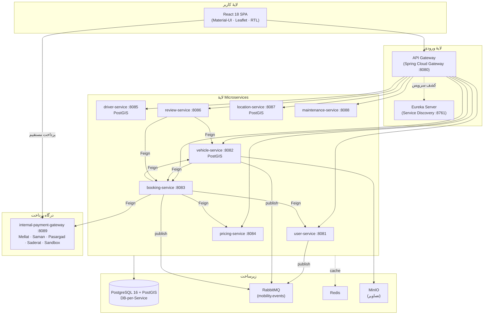
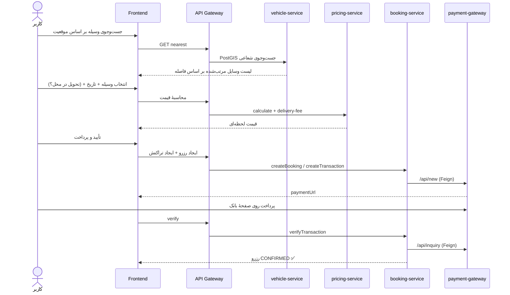

# سکوی اجارهٔ وسایل حمل‌ونقل (Mobility Rental Platform)

### سند ارائه و مستندسازی فنی پروژه

> **نسخه:** ۱.۰ &nbsp;•&nbsp; **تاریخ:** تیر ۱۴۰۴ &nbsp;•&nbsp; **وضعیت:** نسخهٔ نهایی (Production-Ready)
> **معماری:** Microservices &nbsp;•&nbsp; **Backend:** Spring Boot ۳.۲ / Java 17 &nbsp;•&nbsp; **Frontend:** React 18

---

## فهرست مطالب

1. [خلاصهٔ اجرایی](#۱-خلاصهٔ-اجرایی)
2. [ضرورت و اهمیت پروژه](#۲-ضرورت-و-اهمیت-پروژه)
3. [دلیل پیاده‌سازی و انتخاب رویکرد](#۳-دلیل-پیادهسازی-و-انتخاب-رویکرد)
4. [نیازمندی‌ها (تحلیل و مستندسازی)](#۴-نیازمندیها-تحلیل-و-مستندسازی)
5. [طراحی و معماری سیستم](#۵-طراحی-و-معماری-سیستم)
6. [Microserviceها و سایز اجزا](#۶-microserviceها-و-سایز-اجزا)
7. [الگوهای ارتباطی و جریان داده](#۷-الگوهای-ارتباطی-و-جریان-داده)
8. [مدل داده و پایگاه‌داده](#۸-مدل-داده-و-پایگاهداده)
9. [قابلیت‌های کلیدی (Features)](#۹-قابلیتهای-کلیدی-features)
10. [سناریوهای اصلی کسب‌وکار](#۱۰-سناریوهای-اصلی-کسبوکار)
11. [امنیت](#۱۱-امنیت)
12. [استقرار و DevOps](#۱۲-استقرار-و-devops)
13. [راهنمای استفاده (User Guide)](#۱۳-راهنمای-استفاده-user-guide)
14. [سناریوی دموی ارائه](#۱۴-سناریوی-دموی-ارائه)
15. [آمار و دستاوردها](#۱۵-آمار-و-دستاوردها)
16. [چالش‌ها و درس‌های آموخته](#۱۶-چالشها-و-درسهای-آموخته)
17. [نقشهٔ راه آینده (Roadmap)](#۱۷-نقشهٔ-راه-آینده-roadmap)

---

## ۱. خلاصهٔ اجرایی

**سکوی اجارهٔ وسایل حمل‌ونقل** یک پلتفرم کامل و مقیاس‌پذیر برای اجارهٔ انواع وسایل نقلیه (خودرو، موتور، اسکوتر، دوچرخه) است که با معماری **Microservices** پیاده‌سازی شده است. کاربر می‌تواند نزدیک‌ترین وسیله را روی نقشه پیدا کند، آن را به‌صورت **سلف‌سرویس (بدون راننده)** اجاره کند، هزینه را به‌صورت لحظه‌ای و شفاف ببیند، از طریق **درگاه پرداخت واقعی** پرداخت کند و در پایان نظر و امتیاز ثبت کند.

پلتفرم علاوه بر مدل کلاسیک اجاره، از **تحویل وسیله در محل کاربر (Vehicle Delivery)** با هزینهٔ مبتنی بر فاصله نیز پشتیبانی می‌کند.

| ویژگی | مقدار |
|---|---|
| تعداد Microserviceها | ۱۱ ماژول + یک درگاه پرداخت مستقل |
| زبان/فریم‌ورک Backend | Java 17 · Spring Boot 3.2 · Spring Cloud 2023 |
| فریم‌ورک Frontend | React 18 · Material-UI · Leaflet |
| پایگاه‌داده | PostgreSQL 16 + افزونهٔ مکانی PostGIS |
| پیام‌رسان | RabbitMQ (event-driven) |
| کش | Redis |
| ذخیرهٔ فایل/تصویر | MinIO (Object Storage) |
| کشف سرویس | Netflix Eureka |
| استقرار | Docker · Docker Compose |

---

## ۲. ضرورت و اهمیت پروژه

### چرا این پلتفرم لازم است؟

**۱) تغییر الگوی مالکیت به دسترسی (Ownership → Access).**
نسل جدید کاربران به‌جای «خرید و نگهداری» وسیلهٔ نقلیه، به «دسترسی لحظه‌ای و پرداخت به‌ازای استفاده» گرایش دارد. اقتصاد اشتراکی (Sharing Economy) این نیاز را به یک بازار بزرگ تبدیل کرده است.

**۲) حمل‌ونقل شهری و مسئلهٔ آخرین‌کیلومتر (Last-Mile).**
در شهرهای شلوغ، جابه‌جایی کوتاه با اسکوتر/دوچرخه/موتور سریع‌تر، ارزان‌تر و کم‌آلاینده‌تر از خودروی شخصی است. یک پلتفرم واحد که همهٔ این گزینه‌ها را یکجا و مبتنی بر موقعیت مکانی عرضه کند، ارزش واقعی ایجاد می‌کند.

**۳) اثر محیط‌زیستی و کاهش ترافیک.**
اشتراک‌گذاری ناوگان، تعداد خودروهای بلااستفاده را کاهش می‌دهد؛ گزینه‌های برقی/سبک ردپای کربن را کم می‌کنند.

**۴) درآمدزایی برای مالکان وسیله (Peer-to-Peer).**
مالکان می‌توانند وسیلهٔ خود را ثبت و اجاره دهند (در این پروژه هر کاربر می‌تواند نقش مالک/Owner داشته باشد و وسیله‌اش را با تعیین قیمت و شعاع تحویل عرضه کند) — این یعنی یک بازار دوطرفه (Two-sided Marketplace).

**۵) شفافیت قیمت و اعتماد.**
قیمت‌گذاری پویا (Dynamic Pricing)، نمایش لحظه‌ای هزینه پیش از پرداخت، سیستم نظر و امتیاز، و درگاه پرداخت امن، اعتماد لازم برای یک تراکنش مالی آنلاین را فراهم می‌کند.

### اهمیت فنی

این پروژه یک **نمونهٔ کامل و واقعی از معماری Microservices** است که مفاهیم کلیدی مهندسی نرم‌افزار مدرن را به‌شکل عملی پیاده کرده است: تفکیک مسئولیت‌ها، کشف سرویس، API Gateway، ارتباط بین‌سرویسی، معماری رویدادمحور، پرس‌وجوهای مکانی (Geospatial)، و یکپارچگی با درگاه پرداخت بانکی واقعی.

---

## ۳. دلیل پیاده‌سازی و انتخاب رویکرد

### چرا معماری Microservices؟

| نیاز کسب‌وکار | تصمیم معماری | فایده |
|---|---|---|
| هر دامنه (کاربر، وسیله، رزرو، پرداخت…) منطق و نرخ تغییر متفاوتی دارد | تفکیک به سرویس‌های مستقل | توسعه و استقرار مستقل هر تیم/سرویس |
| بار روی «جست‌وجوی مکانی» و «رزرو» متفاوت از بقیه است | مقیاس‌پذیری افقی سرویس‌به‌سرویس | مصرف بهینهٔ منابع |
| خرابی یک بخش نباید کل سیستم را بخواباند | ایزوله‌سازی خطا (Fault Isolation) | تاب‌آوری بالاتر |
| نیاز به تکنولوژی متفاوت در هر دامنه (مثلاً PostGIS فقط جایی که لازم است) | پایگاه‌دادهٔ مجزا به‌ازای هر سرویس (Database-per-Service) | جفت‌شدگی کم (Loose Coupling) |

### چرا این استک فنی؟

- **Spring Boot + Spring Cloud:** اکوسیستم بالغ برای Microservices؛ ابزارهای آماده برای Gateway، Service Discovery و Feign Client.
- **PostgreSQL + PostGIS:** نیاز اصلی این پروژه «یافتن نزدیک‌ترین وسیله/راننده» است؛ PostGIS پرس‌وجوهای مکانی را بومی پشتیبانی می‌کند.
- **RabbitMQ:** برای ارتباط ناهمگام (Asynchronous) و انتشار رویدادها بدون جفت‌شدگی مستقیم سرویس‌ها.
- **Redis:** کش دادهٔ پرتکرار و بهبود کارایی.
- **MinIO:** ذخیرهٔ تصاویر وسایل به‌صورت Object Storage سازگار با S3، به‌جای انباشتن فایل در دیتابیس.
- **React + Material-UI + Leaflet:** رابط کاربری واکنش‌گرا (Responsive)، راست‌به‌چپ (RTL) فارسی، و نقشهٔ تعاملی برای انتخاب موقعیت.
- **درگاه پرداخت داخلی:** یکپارچگی با درگاه واقعی چندبانکی ایرانی (Mellat/Behpardakht، Saman/SEP، Pasargad، Saderat) به‌همراه محیط Sandbox برای تست.

---

## ۴. نیازمندی‌ها (تحلیل و مستندسازی)

### ۴.۱ ذی‌نفعان (Actors)

- **کاربر/مشتری (Client):** جست‌وجو، رزرو، پرداخت، ثبت نظر.
- **مالک وسیله (Owner):** ثبت و مدیریت وسیله، تعیین قیمت و امکان تحویل، مشاهدهٔ رزروها.
- **راننده (Driver):** ثبت‌نام، اعلام موجود بودن، دریافت تخصیص سفر.
- **مدیر (Admin):** مدیریت کاربران، وسایل، رزروها و نظارت کلی.

### ۴.۲ نیازمندی‌های عملکردی (Functional Requirements)

| # | نیازمندی | سرویس مسئول |
|---|---|---|
| FR-1 | ثبت‌نام، ورود و احراز هویت مبتنی بر JWT | user-service |
| FR-2 | مدیریت پروفایل کاربر و نقش‌ها (Client/Owner/Driver/Admin) | user-service |
| FR-3 | ثبت وسیله همراه با آپلود تصویر | vehicle-service + MinIO |
| FR-4 | جست‌وجوی وسایل بر اساس موقعیت مکانی و شعاع (nearest) | vehicle-service (PostGIS) |
| FR-5 | فیلتر بر اساس نوع، قیمت و موجود بودن | vehicle-service |
| FR-6 | محاسبهٔ لحظه‌ای قیمت (پایه، اوج، آخر هفته، تخفیف) | pricing-service |
| FR-7 | اعمال کد تخفیف (درصدی/مبلغی) | pricing-service |
| FR-8 | ایجاد و مدیریت چرخهٔ حیات رزرو (ایجاد/تأیید/شروع/پایان/لغو) | booking-service |
| FR-10 | ایجاد و تأیید تراکنش پرداخت (Create/Verify) | booking-service ↔ payment-gateway |
| FR-11 | تحویل وسیله در محل کاربر با هزینهٔ مبتنی بر فاصله | booking + pricing + frontend |
| FR-12 | ثبت نظر و امتیاز برای وسیله و راننده + میانگین امتیاز | review-service |
| FR-13 | داشبورد مدیریتی (کاربران/وسایل/رزروها) | frontend + سرویس‌ها |
| FR-14 | مدیریت انقضای خودکار رزروهای پرداخت‌نشده | booking-service (Scheduler) |

### ۴.۳ نیازمندی‌های غیرعملکردی (Non-Functional Requirements)

- **مقیاس‌پذیری (Scalability):** مقیاس‌پذیری افقی هر سرویس به‌صورت مستقل؛ کش با Redis؛ صف‌بندی با RabbitMQ برای جذب پیک ترافیک.
- **دسترس‌پذیری و تاب‌آوری (Availability/Resilience):** ایزوله‌سازی خطا، Health Check روی همهٔ سرویس‌ها، fallback در محاسبهٔ قیمت هنگام قطعی سرویس، و مدیریت هم‌زمانی (Optimistic Locking) در تأیید پرداخت.
- **امنیت (Security):** احراز هویت JWT، کنترل دسترسی مبتنی بر نقش، اعتبارسنجی سمت سرور، و اصل «هرگز به قیمت ارسالی کاربر اعتماد نکن».
- **کارایی (Performance):** پرس‌وجوهای مکانی بهینه، کش، و ارتباط سبک بین سرویس‌ها با Feign.
- **قابلیت مشاهده (Observability):** Actuator/Health، لاگ‌گیری، آماده برای Prometheus/Micrometer (در درگاه پرداخت فعال است).
- **قابلیت نگهداری (Maintainability):** کتابخانهٔ مشترک `common-lib`، الگوی DTO/MapStruct، و مرزبندی روشن دامنه‌ها.
- **چندزبانگی و RTL:** رابط کاربری کامل فارسی راست‌به‌چپ.

### ۴.۴ نمونهٔ مستند نیازمندی رسمی

فیچر «تحویل در محل» به‌صورت یک سند نیازمندی کامل و رسمی مستند شده است (`DELIVERY_FEATURE_REQUIREMENTS.md`) که شامل Overview، Goals/Non-goals، User Stories، Functional/Non-functional Requirements، Data Model، API Contract، Edge Cases و Acceptance Criteria است — نمونه‌ای از مستندسازی مهندسی نیازمندی در این پروژه.

---

## ۵. طراحی و معماری سیستم

### ۵.۱ نمای کلان معماری



### ۵.۲ اصول طراحی به‌کاررفته

- **API Gateway به‌عنوان تنها نقطهٔ ورود:** همهٔ درخواست‌های کلاینت از `:8080` عبور و به سرویس مقصد مسیریابی (Routing) می‌شوند؛ Load Balancing با `lb://` روی Eureka.
- **Service Discovery (Eureka):** سرویس‌ها خود را در `:8761` ثبت می‌کنند و آدرس یکدیگر را پویا پیدا می‌کنند.
- **Database-per-Service:** هر سرویس دیتابیس منطقی مستقل خودش را دارد؛ بدون اشتراک مستقیم جدول.
- **Server-Authoritative:** قیمت و اعتبارسنجی همیشه سمت سرور بازمحاسبه می‌شود (مثلاً هزینهٔ تحویل و فاصله).
- **Shared Kernel:** ماژول `common-lib` شامل `BaseEntity`، DTOهای مشترک، Enumها، مدیریت خطا و `EventPublisher`.
- **الگوی DTO + MapStruct:** جداسازی مدل دامنه از قرارداد API.

---

## ۶. Microserviceها و سایز اجزا

جدول زیر بر اساس **تحلیل واقعی کد** تهیه شده است (تعداد فایل‌های Java هر ماژول معیار سایز نسبی است):

| # | سرویس | پورت | سایز (فایل Java) | موجودیت اصلی | مسئولیت |
|---|---|---|---|---|---|
| ۱ | **internal-payment-gateway** | 8089 | 🟪🟪🟪🟪🟪 (۱۰۸) | Transaction, Client | درگاه پرداخت چندبانکی واقعی + Sandbox + Envers Audit |
| ۲ | **booking-service** | 8083 | 🟩🟩🟩 (۲۱) | Booking | چرخهٔ حیات رزرو، پرداخت، تحویل، Scheduler انقضا |
| ۳ | **common-lib** | — | 🟩🟩 (۱۷) | BaseEntity | کتابخانهٔ مشترک، EventPublisher، PaymentClient |
| ۴ | **pricing-service** | 8084 | 🟩🟩 (۱۶) | PricingRule, Discount, DeliveryPricingRule | موتور قیمت‌گذاری پویا + هزینهٔ تحویل |
| ۵ | **vehicle-service** | 8082 | 🟩🟩 (۱۲) | Vehicle | کاتالوگ وسایل، جست‌وجوی مکانی، آپلود تصویر |
| ۶ | **review-service** | 8086 | 🟩🟩 (۱۲) | Review | نظر و امتیاز وسیله/راننده |
| ۷ | **user-service** | 8081 | 🟩 (۱۰) | User | ثبت‌نام، ورود، پروفایل، نقش‌ها |
| ۸ | **driver-service** | 8085 | 🟩 (۸) | Driver | مدیریت راننده، یافتن نزدیک‌ترین راننده |
| ۹ | **location-service** | 8087 | 🟨 (۲) | — | پایهٔ خدمات مکانی (PostGIS) — اسکلت |
| ۱۰ | **maintenance-service** | 8088 | 🟨 (۲) | — | پایهٔ نگهداری وسیله — اسکلت |
| ۱۱ | **api-gateway** | 8080 | 🟦 (۱) | — | مسیریابی، Load Balancing (پیکربندی‌محور) |
| ۱۲ | **eureka-server** | 8761 | 🟦 (۱) | — | Service Discovery |

**نکات مهم دربارهٔ سایز اجزا:**
- درگاه پرداخت (۱۰۸ فایل) بزرگ‌ترین جزء است چون یک PSP کامل چندبانکی با امنیت مبتنی بر Client-Token، پایداری تراکنش و Audit با Hibernate Envers است.
- `booking-service` بزرگ‌ترین سرویس دست‌اول است، چون قلب منطق کسب‌وکار (رزرو، پرداخت، تحویل) در آن قرار دارد و بیشترین ارتباط بین‌سرویسی را دارد.
- `location-service` و `maintenance-service` عمداً به‌صورت اسکلت (Skeleton) با پیکربندی PostGIS آماده شده‌اند تا مسیر توسعهٔ آینده باز باشد.

### Frontend (React)

| جزء | تعداد | نمونه‌ها |
|---|---|---|
| صفحات (Pages) | ۱۹ | Home, Search, VehicleDetails, Booking, Payment, PaymentCallback, MyBookings, Profile, AdminDashboard, AdminUsers, AdminVehicles, AdminBookings, DriverDashboard, AddVehicle, EditVehicle, MyVehicles, … |
| کامپوننت‌ها | ۶ | Navbar, Footer, MapView, LocationSelector, MultipleLocationsMap, VehicleBookingsDialog |
| مدیریت وضعیت | Context API | AuthContext |
| لایهٔ API | axios | `api.js` واحد با Interceptor برای توکن |

---

## ۷. الگوهای ارتباطی و جریان داده

پلتفرم از سه الگوی ارتباطی استفاده می‌کند:

### ۷.۱ ارتباط همگام (Synchronous) — REST / Feign
ارتباط بین سرویس‌ها با **OpenFeign** (روی HTTP + okhttp) و Load Balancing از طریق Eureka انجام می‌شود:

- `booking-service` → `vehicle-service` (اطلاعات وسیله)، `user-service` (کاربر)، `pricing-service` (قیمت و هزینهٔ تحویل)، `payment-gateway` (تراکنش).
- `review-service` → `booking-service` (بررسی صلاحیت ثبت نظر)، `vehicle-service`.
- `vehicle-service` → `booking-service`.

### ۷.۲ ارتباط ناهمگام (Asynchronous) — RabbitMQ
`common-lib/EventPublisher` رویدادها را روی Exchange با نام `mobility.events` منتشر می‌کند (توسط user/vehicle/booking). این پایهٔ یک معماری رویدادمحور (Event-Driven) است که امکان افزودن مصرف‌کننده‌ها (Consumers) برای اعلان، گزارش‌گیری و … را بدون تغییر تولیدکننده‌ها فراهم می‌کند.

### ۷.۳ ذخیره و بازیابی فایل — MinIO
تصاویر وسایل هنگام آپلود مستقیماً در MinIO ذخیره و URL آن‌ها نگهداری می‌شود.

---

## ۸. مدل داده و پایگاه‌داده

- **یک نمونهٔ PostgreSQL 16** با ایمیج `postgis/postgis:16-3.4` که **دیتابیس منطقی مجزا به‌ازای هر سرویس** را میزبانی می‌کند: `user_service`, `vehicle_service`, `booking_service`, `pricing_service`, `driver_service`, `review_service`, `location_service`, `maintenance_service` + دیتابیس مستقل درگاه پرداخت.
- **PostGIS / Hibernate Spatial** در سه سرویس فعال است: **vehicle**, **driver**, **location** (برای پرس‌وجوهای مکانی و یافتن نزدیک‌ترین).
- **Envers Audit** در درگاه پرداخت برای ردیابی تغییرات تراکنش‌ها.

### جدول‌های کلیدی (نمونه)

```
vehicles         : مشخصات وسیله، lat/lng، delivery_available، max_delivery_radius_km، rating
bookings         : چرخهٔ حیات رزرو، وضعیت، delivery_requested، delivery_fee، delivery_distance_km، payment_transaction_id
pricing_rules    : قواعد قیمت پایه/اوج/آخر هفته
delivery_pricing_rules : نرخ به‌ازای کیلومتر برای هر نوع وسیله
discounts        : کدهای تخفیف درصدی/مبلغی
reviews          : امتیاز و نظر وسیله/راننده
transactions     : تراکنش‌های درگاه پرداخت (+ نسخه‌های Envers)
```

---

## ۹. قابلیت‌های کلیدی (Features)

### برای کاربر (Client)
- ثبت‌نام/ورود امن با JWT.
- جست‌وجوی نقشه‌محور وسایل بر اساس موقعیت و شعاع (PostGIS).
- فیلتر بر اساس نوع، قیمت، موجود بودن.
- مشاهدهٔ جزئیات وسیله، تصاویر و نظرات کاربران.
- رزرو **بدون راننده** (سلف‌سرویس).
- **تحویل در محل من:** انتخاب نقطهٔ تحویل روی نقشه، نمایش فاصله و هزینهٔ تحویل پیش از پرداخت.
- محاسبهٔ لحظه‌ای قیمت + کد تخفیف.
- پرداخت امن از طریق درگاه بانکی و تأیید خودکار رزرو.
- مدیریت رزروها، لغو، و ثبت نظر و امتیاز.

### برای مالک وسیله (Owner)
- ثبت و ویرایش وسیله + آپلود تصویر.
- فعال‌سازی «امکان تحویل» و تعیین حداکثر شعاع تحویل.
- مشاهدهٔ رزروهای وسیله و آدرس/فاصلهٔ تحویل.

### برای مدیر (Admin)
- داشبورد مدیریت کاربران، وسایل و رزروها.

### قابلیت‌های ویژه (Highlights)
- **جست‌وجوی مکانی PostGIS** (وسیله و راننده).
- **موتور قیمت‌گذاری پویا** (پایه، اوج، آخر هفته، تخفیف بلندمدت، کد تخفیف).
- **یکپارچگی با درگاه پرداخت چندبانکی واقعی** + Sandbox.
- **تحویل مبتنی بر فاصله** با اعتبارسنجی سمت سرور (Haversine).
- **مدیریت خودکار انقضای رزرو** با Scheduler.

---

## ۱۰. سناریوهای اصلی کسب‌وکار

### ۱۰.۱ رزرو بدون راننده



### ۱۰.۲ جریان پرداخت (سه مرحله)
1. **Create (نیازمند احراز هویت):** Frontend → API Gateway → booking-service → (Feign) → payment-gateway `/api/new`. شمارهٔ رزرو از `invoiceId` استخراج و `transactionId` روی رزرو ذخیره می‌شود.
2. **Pay (بدون احراز هویت، مستقیم):** Frontend مستقیماً صفحهٔ پرداخت درگاه (`:8089`) را باز می‌کند.
3. **Verify (نیازمند احراز هویت، Idempotent):** booking-service با `inquiry` وضعیت را می‌گیرد و در صورت موفقیت، رزرو را از PENDING به CONFIRMED می‌برد. در برابر تأیید هم‌زمان (Optimistic Locking) مقاوم است و اجرای دوباره اثر جانبی ندارد.

### ۱۰.۳ تحویل در محل (Delivery)
1. مالک وسیله را با `deliveryAvailable=true` و شعاع مشخص ثبت می‌کند.
2. کاربر در صفحهٔ رزرو، نقطهٔ تحویل را روی نقشه انتخاب می‌کند.
3. سرور فاصله را با **Haversine** بازمحاسبه می‌کند؛ اگر بیش از شعاع مجاز باشد، با خطای `DELIVERY_OUT_OF_RADIUS` رد می‌شود.
4. هزینهٔ تحویل = `ratePerKm × distance` از pricing-service (با fallback محلی) محاسبه و روی رزرو ذخیره می‌شود. **قیمت ارسالی کاربر هرگز مبنا نیست.**

---

## ۱۱. امنیت

- **احراز هویت:** JWT (کتابخانهٔ jjwt) با مدیریت توکن در Frontend (Interceptor).
- **کنترل دسترسی:** مبتنی بر نقش (Client/Owner/Driver/Admin) و مسیرهای محافظت‌شده (Protected Routes).
- **اعتبارسنجی سمت سرور:** بازمحاسبهٔ قیمت و فاصله؛ اصل عدم اعتماد به ورودی کلاینت.
- **درگاه پرداخت:** امنیت مبتنی بر Client-Token، پایداری و Audit تراکنش‌ها با Hibernate Envers.
- **مدیریت هم‌زمانی:** Optimistic Locking در تأیید پرداخت برای جلوگیری از تأیید/تغییر دوگانه.
- **ایزوله‌سازی شبکه:** شبکهٔ Docker مجزا برای سرویس‌ها.

---

## ۱۲. استقرار و DevOps

### کانتینرها (docker-compose)

| گروه | سرویس‌ها |
|---|---|
| زیرساخت | postgres (PostGIS)، rabbitmq، redis، minio، pgadmin، redis-commander |
| اپلیکیشن | eureka، api-gateway، ۸ سرویس دامنه، payment-gateway، frontend |

### راه‌اندازی یک‌دستوری

```bash
# لینوکس/مک
chmod +x start-all.sh
./start-all.sh
```

این اسکریپت پیش‌نیازها را بررسی، زیرساخت (PostgreSQL + RabbitMQ + Redis + MinIO) را بالا می‌آورد، همهٔ سرویس‌های Backend را build و اجرا می‌کند، Frontend را استارت می‌زند و مرورگر را روی `http://localhost:3000` باز می‌کند.

- **اجرای اول:** ~۵ تا ۸ دقیقه &nbsp;•&nbsp; **اجراهای بعدی:** ~۲ تا ۳ دقیقه
- **توقف کامل:** `./stop-all.sh`

### نقاط دسترسی

| سرویس | آدرس |
|---|---|
| Frontend | http://localhost:3000 |
| API Gateway | http://localhost:8080 |
| Eureka Dashboard | http://localhost:8761 |
| RabbitMQ Management | http://localhost:15672 |
| MinIO Console | http://localhost:9001 |
| Swagger هر سرویس | http://localhost:808X/.../swagger-ui.html |

---

## ۱۳. راهنمای استفاده (User Guide)

### گام ۱ — ثبت‌نام و ورود
به `http://localhost:3000` بروید، روی «ثبت‌نام» بزنید، فرم را پر کنید. پس از ثبت‌نام، توکن JWT صادر و وارد می‌شوید.

### گام ۲ — جست‌وجوی وسیله
از صفحهٔ «جست‌وجو» موقعیت خود را روی نقشه انتخاب یا مختصات را وارد کنید، شعاع (مثلاً ۵ کیلومتر) و نوع وسیله را تعیین کنید. سیستم با PostGIS نزدیک‌ترین وسایل موجود را مرتب‌شده بر اساس فاصله نشان می‌دهد.

### گام ۳ — مشاهدهٔ جزئیات
روی کارت وسیله بزنید تا مشخصات، تصاویر، قیمت و نظرات کاربران و میانگین امتیاز را ببینید.

### گام ۴ — رزرو
1. تاریخ و ساعت شروع/پایان را انتخاب کنید.
2. برای «تحویل در محل»، سوییچ را روشن و نقطهٔ تحویل را روی نقشه انتخاب کنید؛ فاصله و هزینهٔ تحویل نمایش داده می‌شود.
3. کد تخفیف (اختیاری) را وارد کنید.
4. قیمت لحظه‌ای (پایه + تحویل + اوج/آخرهفته − تخفیف) را ببینید و «ادامه به پرداخت» را بزنید.

### گام ۵ — پرداخت
خلاصهٔ رزرو را بررسی و پرداخت را انجام دهید؛ به صفحهٔ درگاه هدایت می‌شوید. پس از پرداخت، سیستم تراکنش را Verify و رزرو را CONFIRMED می‌کند.

### گام ۶ — مدیریت رزروها و ثبت نظر
از «رزروهای من» وضعیت رزروها را ببینید، رزروهای در انتظار را لغو کنید و پس از اتمام، امتیاز و نظر ثبت کنید.

### برای مالکان و مدیران
- **مالک:** از «وسایل من» وسیله ثبت/ویرایش، تصویر آپلود و «امکان تحویل» و شعاع را تنظیم کنید؛ رزروهای هر وسیله و آدرس تحویل را ببینید.
- **مدیر:** از داشبورد مدیریتی، کاربران/وسایل/رزروها را مدیریت کنید.

---

## ۱۴. سناریوی دموی ارائه

پیشنهاد برای نمایش زندهٔ ~۷ دقیقه‌ای:

1. **(۳۰ث)** بالا آوردن سیستم با `./start-all.sh` و نمایش Eureka Dashboard (همهٔ سرویس‌های ثبت‌شده).
2. **(۱ دق)** ثبت‌نام کاربر جدید + ورود.
3. **(۱ دق)** جست‌وجوی نقشه‌محور و نمایش نزدیک‌ترین وسایل (PostGIS).
4. **(۱ دق)** جزئیات وسیله + نظرات.
5. **(۱.۵ دق)** رزرو با فعال‌سازی «تحویل در محل» → انتخاب نقطه روی نقشه → نمایش زندهٔ فاصله و هزینه.
6. **(۱.۵ دق)** پرداخت در Sandbox درگاه → بازگشت → تأیید خودکار و CONFIRMED شدن رزرو.
7. **(۳۰ث)** ثبت نظر و نمایش تأثیر آن روی میانگین امتیاز وسیله.

---

## ۱۵. آمار و دستاوردها

| دسته | معیار | مقدار |
|---|---|---|
| Backend | تعداد سرویس‌ها | ۱۱ ماژول + درگاه پرداخت |
| Backend | Endpointهای API | ۴۵+ |
| Frontend | صفحات React | ۱۹ |
| Frontend | کامپوننت‌ها | ۶ |
| زیرساخت | کانتینرها | ~۱۳ |
| داده | دیتابیس منطقی | ۸ سرویس + درگاه پرداخت |
| مکانی | سرویس‌های PostGIS | ۳ (vehicle, driver, location) |
| پرداخت | بانک‌های پشتیبانی‌شده | Mellat, Saman, Pasargad, Saderat + Sandbox |

**دستاوردهای کلیدی:** پیاده‌سازی کامل معماری Microservices با API Gateway و Service Discovery؛ جست‌وجوی مکانی واقعی؛ موتور قیمت‌گذاری پویا؛ یکپارچگی با درگاه پرداخت بانکی واقعی؛ فیچر تحویل مبتنی بر فاصله با اعتبارسنجی امن سمت سرور؛ و رابط کاربری کامل فارسی واکنش‌گرا.

---

## ۱۶. چالش‌ها و درس‌های آموخته

- **جفت‌شدگی و مرزبندی دامنه:** تصمیم دربارهٔ اینکه هر منطق در کدام سرویس بنشیند (مثلاً محاسبهٔ فاصله در booking و نرخ در pricing) نیازمند طراحی دقیق مرزها بود.
- **تراکنش‌های توزیع‌شده:** هماهنگی رزرو و پرداخت بدون تراکنش سراسری، با طراحی جریان Create/Verify و Idempotency و Optimistic Locking حل شد.
- **اعتماد به کلاینت:** همهٔ قیمت‌ها و فاصله‌ها سمت سرور بازمحاسبه می‌شوند تا از دستکاری جلوگیری شود.
- **تاب‌آوری:** افزودن fallbackها (مثل محاسبهٔ محلی هزینهٔ تحویل هنگام قطعی pricing-service).
- **مقیاس‌پذیری تدریجی:** اسکلت‌سازی سرویس‌های location/maintenance و آماده‌سازی زیرساخت رویدادمحور برای رشد آینده.

---

## ۱۷. نقشهٔ راه آینده (Roadmap)

- **اجارهٔ همراه با راننده (Ride with Driver):** افزودن قابلیت رزرو وسیله به‌همراه راننده و تخصیص خودکار نزدیک‌ترین رانندهٔ موجود (بر پایهٔ `driver-service` و جست‌وجوی مکانی PostGIS).
- **مصرف‌کننده‌های رویداد (Event Consumers):** افزودن `@RabbitListener` برای اعلان‌ها، گزارش‌گیری و همگام‌سازی، روی زیرساخت انتشار رویداد موجود.
- **gRPC:** تبدیل مسیرهای پرترافیک بین‌سرویسی (وابستگی‌های آن در پروژه اعلان شده) به gRPC برای کارایی بالاتر.
- **تکمیل location/maintenance:** Geofencing، مناطق سرویس، زمان‌بندی نگهداری.
- **قابلیت مشاهدهٔ کامل:** Prometheus + Grafana + Distributed Tracing (Zipkin/Jaeger).
- **CI/CD و Kubernetes:** خط لولهٔ خودکار و استقرار ابری.
- **اپ موبایل، پیش‌بینی تقاضا (AI) و برنامهٔ وفاداری.**

---

<div align="center">

**سکوی اجارهٔ وسایل حمل‌ونقل** — نسخهٔ ۱.۰

معماری Microservices · Spring Boot · React · PostGIS · درگاه پرداخت واقعی

</div>